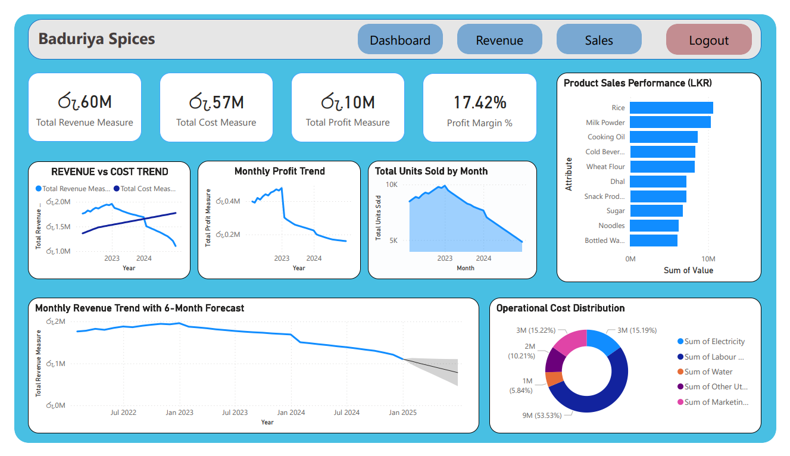

# Baduiriya Spices – Power BI Dashboard

Power BI dashboard analyzing **Baduiriya Spices' revenue, sales, profitability, costs, product performance, and revenue forecasts**.

## 📊 Dashboard Preview



## 🎯 Project Overview

This project uses **Microsoft Power BI** to analyze the financial and operational performance of Baduiriya Spices.

The dashboard provides insights into revenue trends, profitability, product sales, units sold, operational costs, and future revenue expectations.

## 📌 Key Performance Indicators

| KPI | Value |
|---|---:|
| Total Revenue | 6.60M |
| Total Cost | 5.57M |
| Total Profit | 1.10M |
| Profit Margin | 17.42% |

## 📈 Dashboard Analysis

### 💰 Revenue & Cost Analysis
Compares revenue and operational costs over time to understand the company's financial performance.

### 📊 Profit Analysis
Tracks monthly profit trends and evaluates overall profitability.

### 🛒 Product Sales Performance
Identifies the best-performing products based on sales value, including:

- Rice
- Milk Powder
- Cooking Oil
- Cold Beverages
- Wheat Flour
- Dhal
- Snack Products
- Sugar
- Noodles
- Bottled Water

### 📦 Monthly Unit Sales
Analyzes the number of units sold each month and identifies changes in sales volume over time.

### 🔮 Revenue Forecast
Uses a **6-month forecast** to estimate future revenue and support business planning.

### ⚙️ Operational Cost Distribution
Breaks down operational expenses such as:

- Labour
- Electricity
- Water
- Marketing
- Other utilities

## 💡 Key Insights

- The business generates approximately **6.60M in total revenue**.
- Total profit is approximately **1.10M**, resulting in a **17.42% profit margin**.
- Rice and Milk Powder are among the strongest-performing products.
- Monthly unit sales show a declining trend in the later period.
- Labour represents the largest share of operational costs.
- The revenue forecast indicates continued monitoring is important for future business performance.

## 🛠️ Tools Used

- **Microsoft Power BI**
- **Power Query**
- **DAX**
- **Data Visualization**
- **Forecasting**

## 📂 Project Structure

```text
BaduiriyaSpicesPowerBI/
│
├── PowerBI/
│   ├── BaduriyaSpicesLtd.pbip
│   ├── BaduriyaSpicesLtd.Report/
│   └── BaduriyaSpicesLtd.SemanticModel/
│
├── ScreenShot/
│   └── DashBoard.png
│
├── .gitignore
└── README.md